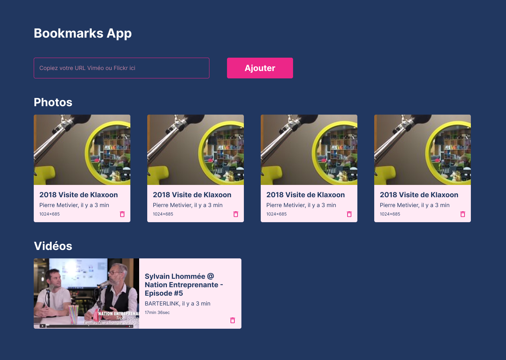

Bookmark app
================================

L'app tourne avec node v17

```
nvm use v17
```

Vous devez également modifier le fichier server/.env avec les infos de votre BDD MySQL. Par exemple:

```
export DB_HOST=localhost
export DB_PORT=3306
export DB_USER=root
export DB_PASSWORD=rootroot
export DB_NAME=bookmark
```

Pas besoin de créer la BDD, elle est créée automatiquement.


Running backend
---------------

    cd server; yarn; npm run start

Running frontend
----------------

    cd client; yarn; npm run start

Maquette
----------------
J'ai réalisé une rapide maquette sur Figma pour guider le frontend

[Lien vers le Figma](https://www.figma.com/file/2xaHqfx4Jr8zquQ20lot4e/BookmarkApp?node-id=0%3A1)




Test
----------------

#### Test d'integration frontend

    cd client; npm run cypress:run

#### Test unitaire frontend

    cd client; npm run test

#### Test unitaire / integration backend

    cd server; npm run test
